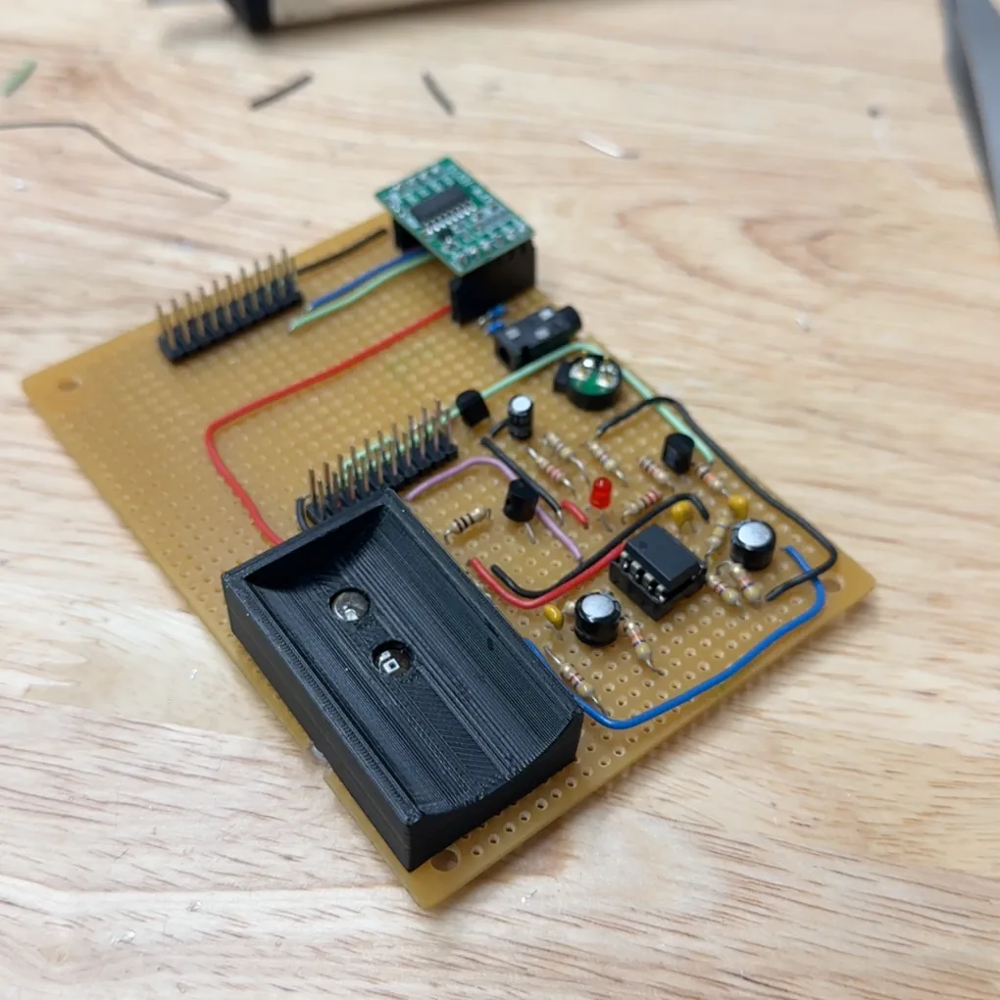
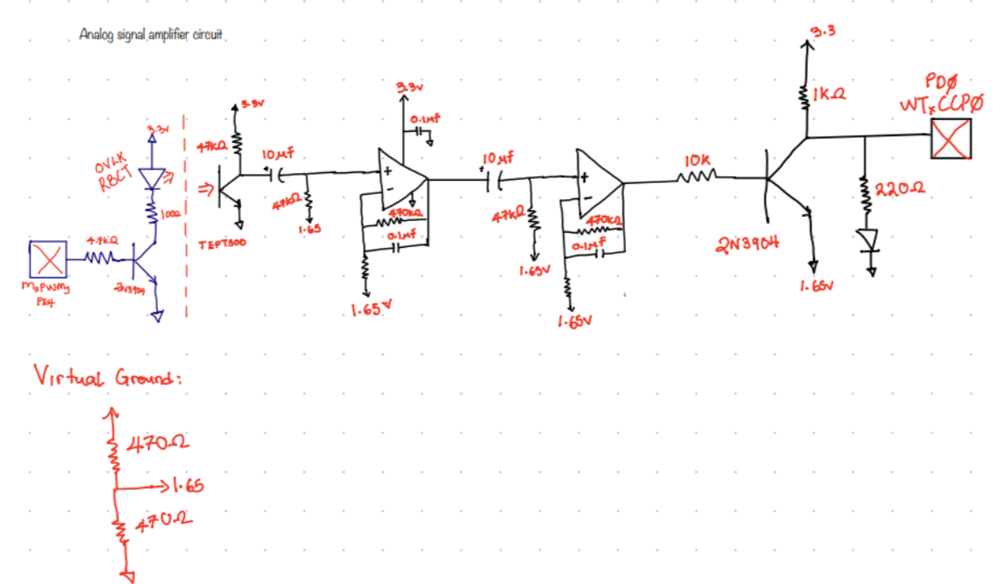
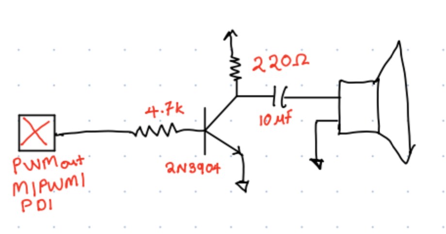
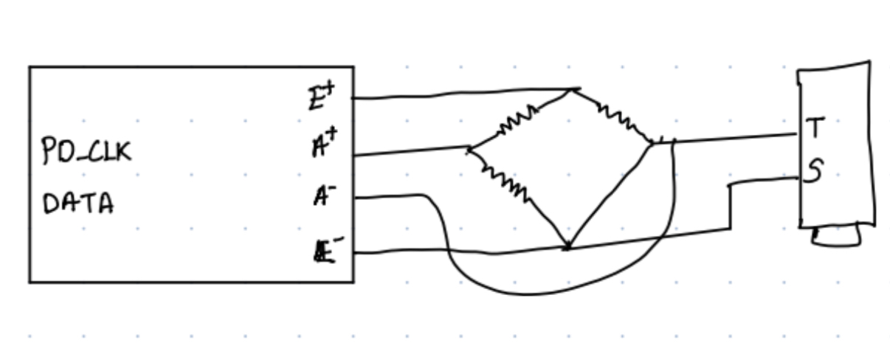
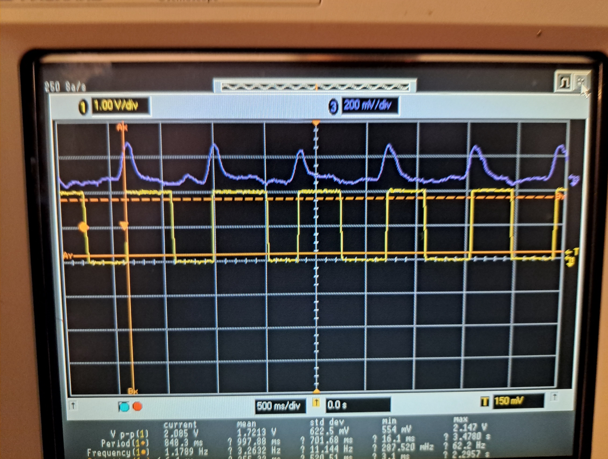

# ❤️ Biosensor Pulse & Respiration Monitor  

**Real-time heart rate and respiration tracking using embedded systems!**  

<p align="center">
  
</p>

## 📑 Table of Contents  
- [🌟 Project Overview](#-project-overview)  
- [🛠️ Hardware Design](#️-hardware-design)  
- [🎛️ Software Capabilities](#-software-capabilities)  
- [🚀 Results & Achievements](#-results--achievements)  
- [🔧 How to Use](#-how-to-use)  
- [🤖 Future Enhancements](#-future-enhancements)  
- [📝 License](#-license)  

## 🌟 Project Overview  

This **non-medical biosensor device** monitors **heart rate (BPM)** and **respiration rate (breaths per minute)** in real time. It uses:  
✔ **Phototransistor + LED** to measure **pulse rate** via blood flow changes in a finger.  
✔ **Strain gauge + HX711 ADC** to detect **respiratory movement** through a diaphragm-worn apparatus.  
✔ **PWM buzzer speaker** to trigger alerts when thresholds are exceeded.  
✔ **Shell command interface** for adjusting heart/breath rate limits and viewing data dynamically.  

The project is implemented on a **TM4C123GXL microcontroller** and demonstrates **practical signal processing** in embedded systems.  

---

## 🛠️ Hardware Design  
<p align="center">
  
</p>
<p align="center">
  <b>Figure 1: Hardware setup for biosensor device</b>
</p>

### Key Components:  
- **Microcontroller:** TM4C123GXL (ARM Cortex-M4)  
- **Pulse Sensor:** TEPT5700 phototransistor with a red LED  
- **Respiration Sensor:** HX711 ADC + 350Ω strain gauge  
- **Amplifiers & Filtering:** LM358 dual op-amp for signal conditioning  
- **Buzzer:** Alerts users when thresholds are exceeded  

### Circuit Design:  
<p align="center">
  
</p>
<p align="center">
  <b>Figure 2: Circuit diagram of the amplifier circuit that converts the varying analog signal</b>
</p>

<p align="center">
  
</p>
<p align="center">
  <b>Figure 3: Circuit diagram of the speaker</b>
</p>

<p align="center">
  
</p>
<p align="center">
  <b>Figure 4: This figure shows the circuitry for the respiratory analysis part of the project</b>
  The connection of the HX711 involves the DATA and the PD_CLK being connected to the controller. Then a 350 ohms resistor is connected from E+ to A+, E+ to A-, and E- to A+. Afterward, the tip of the TRS jack is connected to the A- terminal, and the shield connects to the E-.
</p>

<p align="center">
  
</p>
<p align="center">
  <b>Figure 4: Scope Capture of the circuit </b>
  <br>
  The figure examines the sensor input to the circuit and the final output to the timer CCP0 pin of the controller.
</p>

---

## 🎛️ Software Capabilities  

### **Signal Processing & Data Acquisition**  
✅ **Pulse Detection:** Reads LED reflection changes and converts to BPM.  
✅ **Respiration Detection:** Measures strain gauge voltage fluctuations to calculate breath rate.  
✅ **Data Smoothing:** Implements low-pass filtering to remove noise.  

### **Shell Interface Commands**  
💻 **Set Limits:** Configure **min/max heart rate** and **respiratory thresholds**.  
💻 **Real-time Monitoring:** View current BPM & breath rate.  
💻 **Continuous Reporting:** Enable **live data streaming** to terminal.  
💻 **Buzzer Alerts:** Get notified when values exceed safe ranges.  

---

## 🚀 Results & Achievements  

✔ **Accurate real-time heart and breath rate monitoring**  
✔ **Fully functional embedded system with live data feedback**  
✔ **Customizable user interface via shell commands**  
✔ **Compact, low-power, and cost-effective design**  

---

## 🔧 How to Use  

1️⃣ **Assemble the Circuit:** Follow the hardware setup diagram and connect components.  
2️⃣ **Load the Firmware:** Flash the provided firmware onto the TM4C123GXL board.  
3️⃣ **Open a Serial Terminal:** Use `115200 baud, 8N1, no hardware flow control`.  
4️⃣ **Run Commands:** Monitor vitals and configure alerts in real time.  

### Sample Command:  
```bash
> monitor start
Heart Rate: 72 BPM
Respiration Rate: 18 breaths/min
```

---

## 🤖 Future Enhancements  

🚀 **Wireless Data Streaming** – Send heart & breath rate to a mobile app via Bluetooth.  
🚀 **OLED Display Integration** – Show real-time vitals on a screen.  
🚀 **AI-based Anomaly Detection** – Detect irregular heartbeats or breathing patterns.  

---

